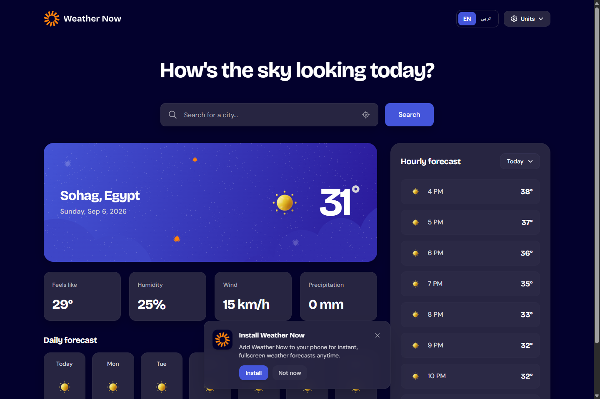
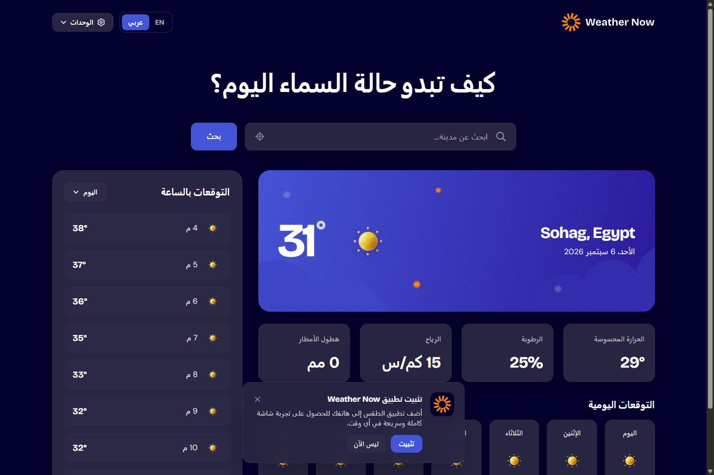
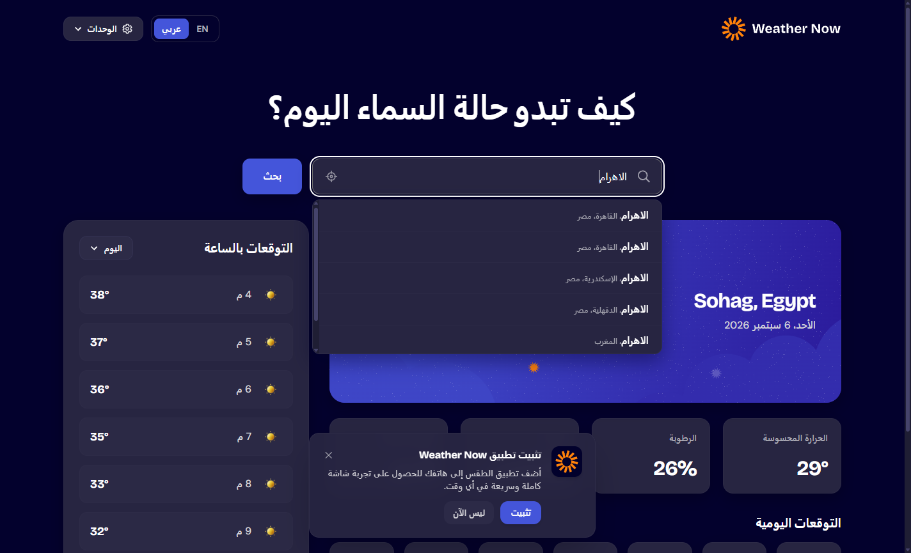

<p align="center">
  
</p>

<h1 align="center">Weather Now</h1>

<p align="center">
  <strong>A premium, bilingual (English & العربية) Progressive Web App (PWA) delivering real-time atmospheric intelligence, intelligent geolocation, and pixel-perfect design system execution.</strong>
</p>

<p align="center">
  <a href="https://weather-now-live.vercel.app">
    
  </a>
  <a href="https://github.com/Eng-MohamedHosny/weather-app">
    
  </a>
  <a href="https://www.frontendmentor.io/challenges/weather-app-K1FhddVm49">
    
  </a>
</p>

<p align="center">
  
  
  
  
  
  
</p>

---

## 🌐 Live Production

| Deployment | URL | Status |
| :--- | :--- | :--- |
| **Official Production** | **[https://weather-now-live.vercel.app](https://weather-now-live.vercel.app)** |  |
| **GitHub Repository** | **[Eng-MohamedHosny/weather-app](https://github.com/Eng-MohamedHosny/weather-app)** |  |
| **Challenge** | [Frontend Mentor — Build a Weather App](https://www.frontendmentor.io/challenges/weather-app-K1FhddVm49) |  |

---

## 📸 Visual Showcase

### English Interface & Dark Atmospheric Hero


### Arabic Interface (Full RTL, Localized Metrics & Dates)


### Intelligent Multi-lingual Search & Custom Theme Scrollbar


---

## ✨ Key Features & Architectural Highlights

### 🌍 1. Full Bilingual Support (English / العربية)
- **Segmented Language Switcher (`[ EN | عربي ]`):** Seamless one-click switching with active state branding and persistence in `localStorage`.
- **Direction-Aware (`dir="rtl"` / `dir="ltr"`):** Automatic document layout mirroring, RTL typography, localized calendar dates, and mirrored UI controls.
- **Natural Arabic Typography:** Tailored typography, Arabic comma punctuation (`،`), and direction-safe temperature units.

### 📱 2. Progressive Web App (PWA)
- **Installable on Mobile & Desktop:** Full `manifest.webmanifest` and Service Worker integration with custom installation prompt modals.
- **Branded Application Icons:** High-resolution maskable vector icons derived from the official design system.
- **Standalone Mode:** Native app feel with transparent status bar styling and offline caching fallback.

### 📍 3. Smart Hybrid Geolocation
- **Zero-Click IP Geolocation:** Instantly detects the user's city on initial launch without nagging permission prompts (fallback to accurate city coordinates).
- **High-Precision GPS Button:** Optional one-tap GPS button inside the search bar allowing users to request real-time device coordinates.

### 🔍 4. Multi-lingual Search with Arabic Autocomplete
- **Intelligent Geocoding Engine:** Supports city searches in English and Arabic (e.g. *Cairo, Sohag, Riyadh, Dubai, Alexandria, Tanta, Beirut*).
- **Diacritic & Spelling Variation Tolerance:** Gracefully handles Arabic variations (such as `أ`, `إ`, `ا`, `آ`, and `ال` prefix stripping) with an automatic OpenStreetMap fallback.
- **Debounced Autocomplete:** Real-time dropdown suggestions with loading spinners and dedicated error states.

### 🎨 5. Figma Pixel-Perfect Soft Noise Shader
- **Velvety Film Grain Hero Section:** Faithfully implements the Figma SVG noise filter (`filter0_n_233_1146`) softened with Gaussian blur and discrete color tables for an elegant atmospheric card.

### 🎛️ 6. Custom Theme Scrollbars
- **Unified Dark Theme Slider:** Replaced default browser scrollbars with custom rounded track and thumb controls styled to match the dark navy palette (`#1a1932` / `#3c3b5c`) with interactive brand blue hover effects.

### 🔄 7. Instant Metric / Imperial System Conversion
- **One-Click Preset Switcher:** Switch between Metric (°C, km/h, mm) and Imperial (°F, mph, in).
- **Fine-Grained Custom Units:** Customize temperature, wind speed, and precipitation units independently via the Units dropdown.

### 📊 8. Comprehensive 7-Day & 24-Hour Forecasts
- **Daily Forecast:** 7-day overview with high/low temperature spreads and weather condition icons.
- **Hourly Forecast:** Hourly temperature graph for any selected day of the week with intuitive day picker.

---

## 🛠️ Tech Stack & Tools

- **Core Framework:** [React 18](https://react.dev/) + [Vite](https://vitejs.dev/)
- **Styling & Design System:** [Tailwind CSS](https://tailwindcss.com/)
- **Design Tokens:** Extracted directly from official Figma Design files via Figma MCP
- **Weather & Geocoding Data:** [Open-Meteo API](https://open-meteo.com/) (Free, reliable, no API key required)
- **Fallback Geocoding:** [OpenStreetMap Nominatim](https://nominatim.openstreetmap.org/)
- **PWA Infrastructure:** [vite-plugin-pwa](https://vite-pwa-org.netlify.app/)
- **Hosting & Edge Delivery:** [Vercel](https://vercel.com/)
- **Typography:** Google Fonts (*DM Sans* & *Bricolage Grotesque*)

---

## 🚀 Getting Started

### Prerequisites
- [Node.js](https://nodejs.org/) (version 18 or higher recommended)
- [npm](https://www.npmjs.com/) or [yarn](https://yarnpkg.com/)

### Installation

1. **Clone the repository:**
   ```bash
   git clone git@github.com:Eng-MohamedHosny/weather-app.git
   cd weather-app
   ```

2. **Install dependencies:**
   ```bash
   npm install
   ```

3. **Start local development server:**
   ```bash
   npm run dev
   ```
   Open `http://localhost:5173` in your browser.

4. **Build for production:**
   ```bash
   npm run build
   ```

5. **Preview production build locally:**
   ```bash
   npm run preview
   ```

---

## 📁 Project Structure

```text
├── docs/
│   └── screenshots/              # High-resolution showcase screenshots
├── public/
│   ├── assets/images/            # Weather icons, status graphics, and logos
│   ├── favicon.svg               # Website and PWA branding icon
│   └── manifest.webmanifest      # Progressive Web App manifest
├── src/
│   ├── components/
│   │   ├── CurrentWeather.jsx    # Hero weather card with soft noise shader
│   │   ├── DailyForecast.jsx     # 7-day weather forecast cards
│   │   ├── ErrorState.jsx        # User-friendly API failure fallback
│   │   ├── HeroWeatherBackground.jsx # Custom SVG filter & noise layer
│   │   ├── HourlyForecast.jsx    # 24-hour forecast with day selector
│   │   ├── InstallPwaModal.jsx   # Custom PWA install prompt banner
│   │   ├── LanguageSwitch.jsx    # Segmented [ EN | عربي ] toggle switch
│   │   ├── Navbar.jsx            # Top bar with logo, units, and language
│   │   ├── SearchBar.jsx         # RTL-ready geocoding autocomplete bar
│   │   ├── UnitsDropdown.jsx     # Metric/Imperial system modal
│   │   └── WeatherMetrics.jsx    # Humidity, wind, precipitation, feels-like
│   ├── context/
│   │   └── LanguageContext.jsx   # Language state, RTL switching & persistence
│   ├── services/
│   │   ├── geolocation.js        # IP geolocation & GPS service
│   │   └── weatherApi.js         # Open-Meteo forecast and geocoding queries
│   ├── utils/
│   │   ├── translations.js       # Complete English & Arabic dictionaries
│   │   └── weatherCodes.js       # WMO code mapper to icons and descriptions
│   ├── App.jsx                   # Main layout coordinator
│   ├── index.css                 # Tailwind directives & custom theme scrollbar
│   └── main.jsx                  # React application entry point
├── index.html                    # Root HTML document
├── tailwind.config.js            # Design tokens & color system
├── vercel.json                   # Vercel deployment routing & headers
├── vite.config.js                # Vite build and PWA configuration
└── README.md                     # Project documentation
```

---

## 👤 Author

**Mohamed Hosny**
- **Frontend Mentor:** [@Eng-MohamedHosny](https://www.frontendmentor.io/profile/Eng-MohamedHosny)
- **GitHub:** [@Eng-MohamedHosny](https://github.com/Eng-MohamedHosny)
- **Portfolio / Live App:** [https://weather-now-live.vercel.app](https://weather-now-live.vercel.app)

---

## 📄 License

This project is licensed under the [MIT License](LICENSE).
